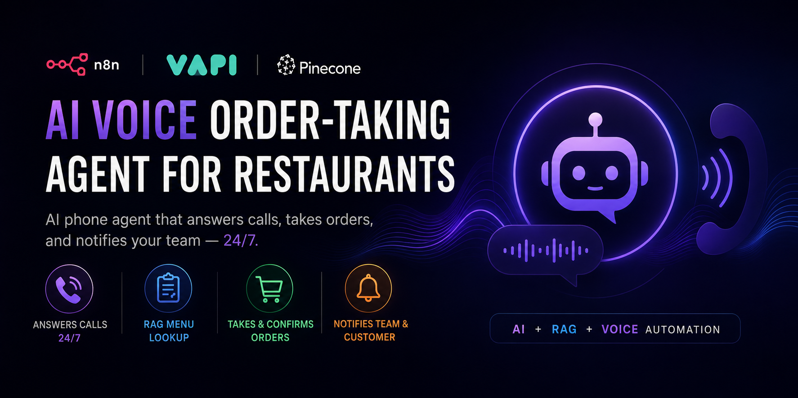
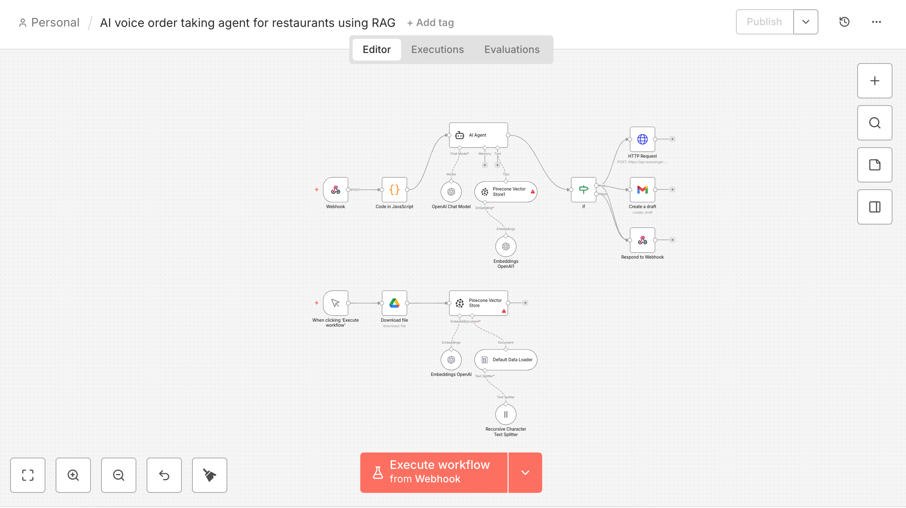

# 🎙️ AI Voice Order-Taking Agent for Restaurants (RAG + VAPI + n8n)

> A fully automated AI phone agent that answers customer calls, retrieves live menu data using RAG, takes orders conversationally, notifies your team, and sends a confirmation to the customer — no human receptionist required.

---

## 📽️ Demo

🎥 **Watch the workflow in action:** [View Demo Video](https://loom.com/share/YOUR_LOOM_LINK_HERE)

---

## 🖼️ Workflow Overview


*Complete n8n workflow — from incoming VAPI webhook to order confirmation and team notification*

---

## 💡 What Problem This Solves

Restaurants lose orders every day to missed calls, understaffed front desks, and language barriers. Hiring someone just to answer the phone and take orders is expensive and inefficient.

This workflow deploys an AI voice agent — named **"Brim"** in the demo — that picks up every call, answers questions about the menu, customises orders, and finalises them automatically. It uses **Retrieval-Augmented Generation (RAG)** so the AI always has accurate, up-to-date menu knowledge, not hallucinated guesses.

The moment an order is placed, your kitchen or manager gets notified, and the customer receives a confirmation message — all without a single human touchpoint.

---

## ✅ What It Does

1. **Receives inbound calls** via a VAPI voice assistant connected to your restaurant's phone number
2. **Greets customers naturally** with a configurable persona and opening message
3. **Retrieves menu data in real-time** using RAG — queries a Pinecone vector store loaded with your restaurant's menu, specials, dietary info, and pricing
4. **Guides customers through ordering** — suggests items, handles customisations (e.g. "no onions"), and recommends add-ons like sides or drinks
5. **Confirms the order** aloud before finalising — name, items, modifications, address, and phone number
6. **Finalises the order** via a tool call that triggers the n8n workflow
7. **Notifies the restaurant team** with full order details (via email, WhatsApp, Slack, or any supported channel)
8. **Sends a confirmation message to the customer** with their order summary
9. **Handles edge cases** — out-of-stock items, silent callers, payment redirects, and voicemails

---

## 🏗️ Architecture Overview

This workflow has two main sub-flows:

### 🔷 Sub-flow 1 — Menu Ingestion (Run Once)
Triggered manually to load your restaurant's menu into the vector store:
- Downloads the menu document from Google Drive
- Splits it into chunks using a Recursive Character Text Splitter
- Generates OpenAI embeddings for each chunk
- Stores everything in **Pinecone** for semantic retrieval

### 🔶 Sub-flow 2 — Live Voice Order Handling (Per Call)
Triggered on every inbound VAPI webhook:
- Receives the customer's query from the voice agent
- Runs a similarity search against Pinecone to fetch relevant menu data
- Returns the answer to VAPI so the agent can speak it naturally
- When the order is finalised, notifies the team and sends customer confirmation

---

## 🛠️ Tools & Integrations

| Tool | Purpose |
|------|---------|
| **VAPI** | Voice AI platform — handles the phone call, STT, TTS, and conversation |
| **n8n** | Workflow automation engine connecting all services |
| **Pinecone** | Vector database for RAG-based menu retrieval |
| **OpenAI (GPT-4o)** | LLM powering the AI agent's responses |
| **OpenAI Embeddings** | Converts menu text into vector representations |
| **Google Drive** | Source storage for menu documents |
| **Gmail / Email** | Sends order confirmation to customers and notifications to staff |
| **Deepgram** | Speech-to-text transcription inside VAPI |

> The AI nodes are compatible with any OpenAI-compatible API (Groq, Mistral, Together AI, Anthropic, Ollama).

---

## 🤖 VAPI Voice Agent Configuration

The included VAPI configuration (`vapi-config.json`) sets up an agent with:

- **Persona:** A friendly, efficient restaurant voice agent
- **RAG Tool:** `menu_tool` — calls the n8n webhook to query Pinecone
- **Order Tool:** `finalise_order` — triggers the order confirmation flow
- **Transcriber:** Deepgram `flux-general-en` for fast, accurate speech recognition
- **Voice:** OpenAI TTS (`alloy`) — swap to any VAPI-supported voice
- **Background denoising:** Enabled for noisy restaurant-call environments
- **Idle handling:** Gentle nudge messages if the caller goes silent

The system prompt instructs the agent to:
- Always query the RAG tool before answering menu questions (no hallucinations)
- Collect name, address, and phone before finalising any order
- Confirm the full order aloud before submission
- Suggest upsells naturally (sides, drinks, meal upgrades)
- Never mention internal tools or the AI infrastructure

---

## 📋 Prerequisites

Before importing this workflow, make sure you have:

- [ ] **n8n** — Cloud or self-hosted (v1.0+)
- [ ] **VAPI account** — Sign up at [vapi.ai](https://vapi.ai) and create a phone number
- [ ] **Pinecone account** — Free tier available at [pinecone.io](https://pinecone.io)
- [ ] **OpenAI API key** — For GPT-4o and text embeddings
- [ ] **Google account** — For Google Drive (menu file storage) and Gmail (notifications)
- [ ] **Your restaurant menu** — As a PDF, DOCX, or plain text file uploaded to Google Drive

---

## ⚙️ Setup Instructions

### Step 1 — Import the Workflow
1. Download `workflow.json`
2. Open your n8n instance
3. Click **+** → **Import from file**
4. Select the downloaded JSON

---

### Step 2 — Connect Your Credentials

In n8n, go to **Credentials** and configure:

**OpenAI**
- Used by: `OpenAI Chat Model`, `Embeddings OpenAI` (both sub-flows)
- Add your OpenAI API key

**Pinecone**
- Used by: `Pinecone Vector Store` (both sub-flows)
- Add your Pinecone API key and set your index name

**Google Drive**
- Used by: `Download file`
- Connect via Google OAuth and set the file ID of your menu document

**Gmail / Email**
- Used by: `Create a draft` (or whichever notification node you configure)
- Connect your Google account or SMTP credentials

---

### Step 3 — Configure Pinecone

1. Log in to [pinecone.io](https://pinecone.io)
2. Create a new index:
   - **Dimensions:** `1536` (for OpenAI `text-embedding-3-small`)
   - **Metric:** `cosine`
3. Copy your index name and region into the Pinecone nodes in n8n

---

### Step 4 — Ingest Your Menu

1. Upload your menu document (PDF or DOCX) to Google Drive
2. Copy the file ID from the Drive URL
3. Paste it into the `Download file` node in n8n
4. Run the **"When clicking Execute Workflow"** sub-flow manually — this ingests your menu into Pinecone
5. You only need to do this once (or whenever your menu changes)

---

### Step 5 — Configure VAPI

1. Import `vapi-config.json` into your VAPI dashboard (or create an assistant manually)
2. Under **Tools**, add two tools:
   - `menu_tool` → HTTP POST to your n8n webhook URL (the RAG query endpoint)
   - `finalise_order` → HTTP POST to your n8n webhook URL (the order finalisation endpoint)
3. Assign the assistant to your VAPI phone number
4. Update the system prompt with your actual restaurant name, location, and branding

---

### Step 6 — Test the Integration

1. Call your VAPI phone number
2. Ask about a menu item — the agent should retrieve accurate details from Pinecone
3. Place a test order — you should receive a notification and the customer confirmation should be triggered
4. Check your n8n execution log for any errors

---

## 🚀 How It Works End-to-End

```
Customer calls restaurant number
        ↓
VAPI answers and greets the customer
        ↓
Customer asks about the menu
        ↓
VAPI calls menu_tool → n8n webhook → Pinecone RAG query
        ↓
Relevant menu info returned to VAPI → spoken to customer
        ↓
Customer places order → VAPI confirms aloud
        ↓
VAPI calls finalise_order → n8n webhook triggered
        ↓
n8n notifies restaurant team (email/Slack/WhatsApp)
        ↓
n8n sends order confirmation to customer
        ↓
Call ends
```

---

## 📤 What the Restaurant Receives

When an order is placed, your team notification includes:

| Field | Description |
|-------|-------------|
| Customer Name | Collected by the voice agent during the call |
| Phone Number | For callback or delivery confirmation |
| Delivery Address | Collected before order is finalised |
| Order Items | Each item with quantity and modifications |
| Timestamp | When the order was placed |

---

## 🎛️ Customisation Options

**Change the restaurant name and persona**
Edit the system prompt in the VAPI assistant settings. Rename the agent, update the opening line, and adjust the tone to match your brand.

**Swap the voice**
In the VAPI config, change `voiceId` to any supported provider/voice. VAPI supports ElevenLabs, PlayHT, Azure, and others for more natural-sounding voices.

**Update the menu**
Upload a new menu file to Google Drive and re-run the ingestion sub-flow. The old Pinecone vectors are replaced with updated content.

**Change the notification channel**
Replace the Gmail node with a Slack, WhatsApp (via Twilio), Telegram, or SMS node — n8n supports all of these natively.

**Add payment link generation**
Extend the `finalise_order` flow to generate a Stripe payment link and include it in the customer confirmation message.

**Support multiple languages**
VAPI supports multilingual configurations. Update the Deepgram transcriber language and adjust the system prompt for your target language.

---

## 🔧 Troubleshooting

**Agent answers but can't find menu items**
- Confirm the menu ingestion sub-flow ran successfully
- Check Pinecone to ensure your index has vectors
- Verify the index name and region match in both sub-flows

**VAPI not triggering the n8n webhook**
- Make sure your n8n webhook URL is publicly accessible (not `localhost`)
- Use ngrok or a cloud n8n instance for testing
- Check VAPI tool configuration — the URL must point to the correct n8n endpoint

**Order notifications not arriving**
- Check Gmail/email credentials in n8n
- Review the execution log for the finalise order branch
- Confirm the customer phone number is being captured correctly by the agent

**Agent hallucinating menu items**
- This means the RAG tool is not being called — check VAPI tool binding
- Ensure `menu_tool` is listed under the assistant's tools in VAPI
- Review the system prompt to confirm the RAG-first directive is in place

**Pinecone returning irrelevant results**
- Your menu document may be too large for single-chunk retrieval — try smaller chunk sizes in the Text Splitter node
- Check that embeddings are generated with the same model used at query time (`text-embedding-3-small`)

---

## 🤖 AI Setup Options

The workflow uses **GPT-4o** by default via VAPI and the n8n agent node. You can swap to any compatible provider:

| Provider | Endpoint |
|----------|----------|
| OpenAI | `https://api.openai.com/v1/chat/completions` |
| Groq | `https://api.groq.com/openai/v1/chat/completions` |
| Together AI | `https://api.together.xyz/v1/chat/completions` |
| Mistral | `https://api.mistral.ai/v1/chat/completions` |
| Anthropic | `https://api.anthropic.com/v1/messages` |

---

## 📄 License & Usage

- ✅ Personal use allowed
- ✅ Commercial use allowed (deploy for your own restaurant or clients)
- ❌ Resale of this template as-is is not permitted

---

## 💼 Looking for a Custom Version?

This is a **demo workflow** built to showcase what's possible. Every real restaurant has different needs — a different menu structure, notification preferences, reservation flows, or multi-location setups.

If you want this built and configured specifically for your restaurant or your client's business, I build these end-to-end:

- Custom menu ingestion pipeline
- Branded voice persona and system prompt
- Integration with your POS or order management system
- Multi-location or multi-language support
- Ongoing maintenance and updates

---

## 📬 Contact & Freelance Enquiries

Available for custom automation builds, AI agent development, and n8n workflow projects:

- **Email:** ibnbilal313@gmail.com
- **WhatsApp:** +923274067546
- **LinkedIn:** [Hamza Abid](https://www.linkedin.com/in/hamza-abid-kemu)

---

*Built with n8n · VAPI · Pinecone · OpenAI · Google Drive · Deepgram*
